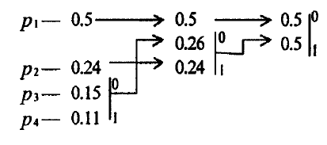

# Huffman coder and decoder
This is student project on the subject **Algorithms for encoding and compressing information**.

Huffman algorithm is a lossless data compression algorithm.

Let's see how the Huffman algorithm works.

1. First, we create a leaf node for each unique character and build a min heap of all leaf nodes
2. Next extract two nodes with the minimum frequency from the min heap.
3. Create a new internal node with a frequency equal to the sum of the two nodes frequencies. Make the first extracted node as its right child and the other extracted node as its left child. Add this node to the min heap.
4. Repeat steps#2 and #3 until the heap contains only one node. The remaining node is the root node and the tree is complete.

